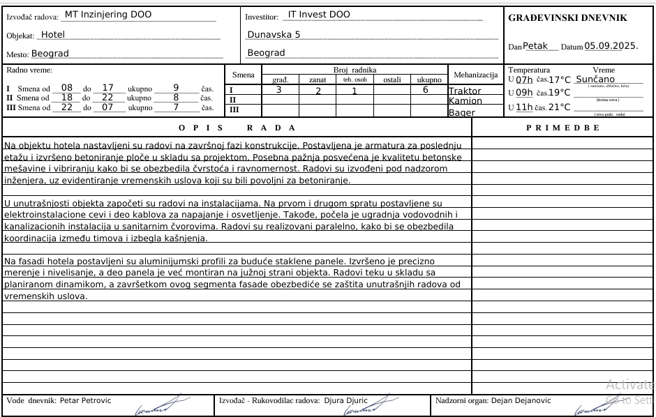
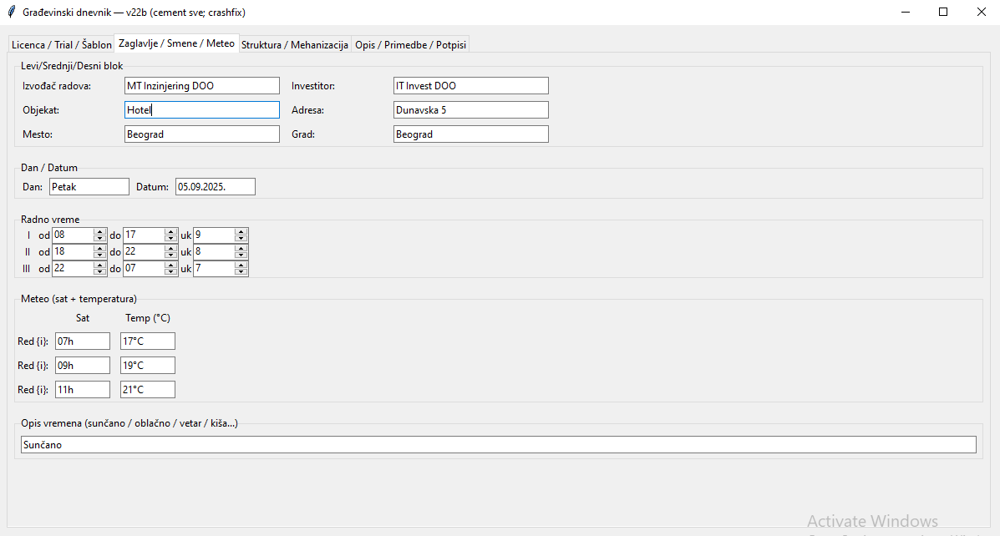
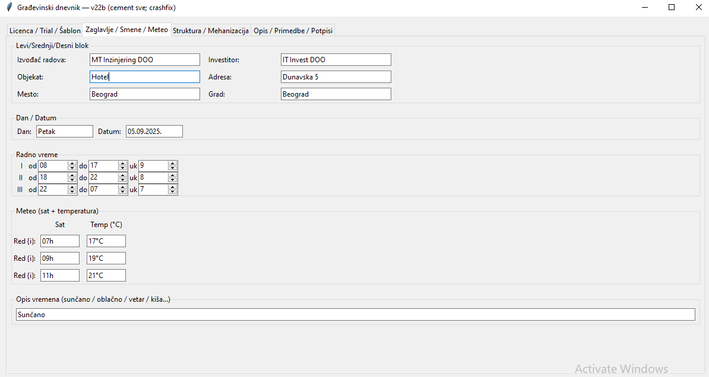
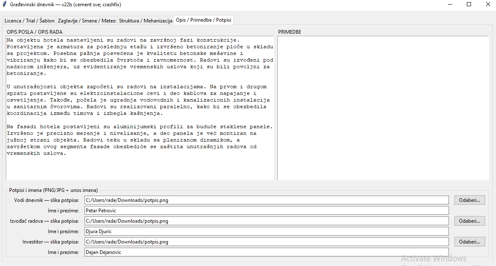
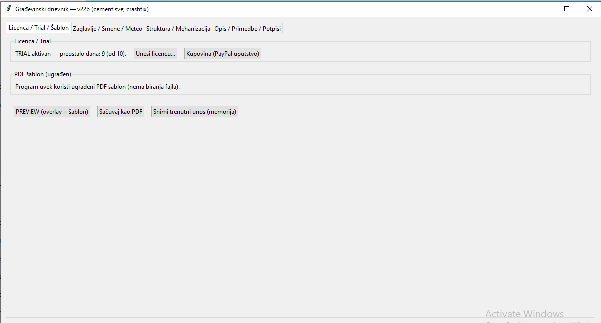

# GDNevnik — dnevnik građevinskih radova (Windows)
- Automatski dan i datum
- Meteo unos (sat + °C + opis)
- Opis posla i Primedbe
- Potpisi (vodi dnevnik, izvođač, investitor)
- Izvoz u PDF (predlog imena `dd.mm.yy.pdf`)

## Preuzimanje
➡️ [Poslednja verzija (Releases)](../../releases/latest)

## Instalacija
Nije potrebna posebna instalacija — pokreni `GDNevnik.exe`.

  
  
  
  
  

